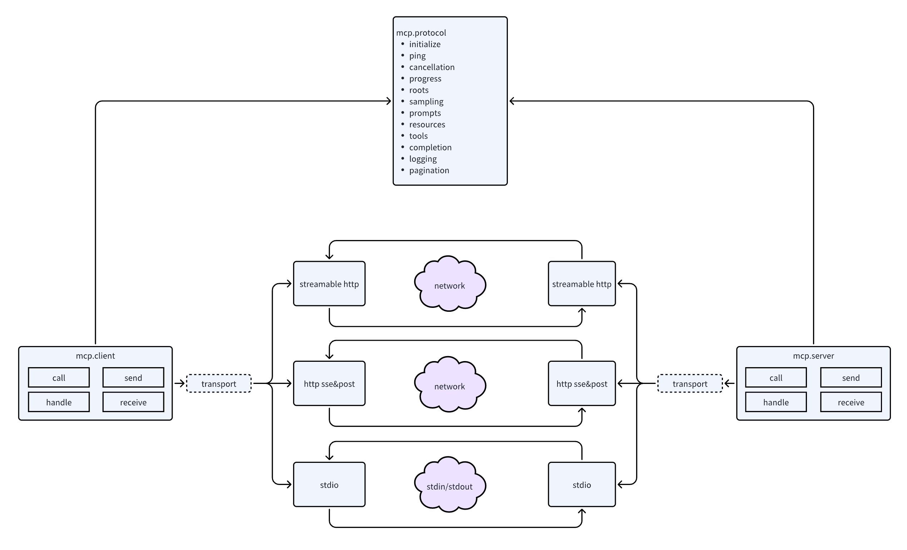

# Go-MCP

<div align="center">

</div>
<br/>

<p align="center">
  <a href="https://github.com/ThinkInAIXYZ/go-mcp/releases"></a>
  <a href="https://github.com/ThinkInAIXYZ/go-mcp/stargazers"></a>
  <a href="https://github.com/ThinkInAIXYZ/go-mcp/network/members"></a>
  <a href="https://github.com/ThinkInAIXYZ/go-mcp/issues"></a>
  <a href="https://github.com/ThinkInAIXYZ/go-mcp/pulls"></a>
  <a href="https://github.com/ThinkInAIXYZ/go-mcp/blob/main/LICENSE"></a>
  <a href="https://github.com/ThinkInAIXYZ/go-mcp/graphs/contributors"></a>
  <a href="https://github.com/ThinkInAIXYZ/go-mcp/commits"></a>
</p>
<p align="center">
  <a href="README.md">English</a>
</p>

## 🚀 概述

Go-MCP 是一個強大的 Go 語言版本 MCP SDK，實現 Model Context Protocol (MCP)，協助外部系統與 AI 應用之間的無縫溝通。基於 Go 語言的強型別與效能優勢，提供簡潔且符合習慣的 API，方便您將外部系統整合進 AI 應用程式。

### ✨ 主要特色

- 🔄 **完整協議實作**：全面實現 MCP 規範，確保與所有相容服務無縫對接
- 🏗️ **優雅的架構設計**：採用清晰的三層架構，支援雙向通訊，確保程式碼模組化與可擴充性
- 🔌 **與 Web 框架無縫整合**：提供符合 MCP 協議的 http.Handler，讓開發者能將 MCP 整合進服務框架
- 🛡️ **型別安全**：善用 Go 的強型別系統，確保程式碼清晰且高度可維護
- 📦 **簡易部署**：受惠於 Go 的靜態編譯特性，無需複雜的相依管理
- ⚡ **高效能設計**：充分發揮 Go 的並行能力，在各種場景下皆能維持優異效能與低資源消耗

## 🛠️ 安裝

```bash
go get github.com/ThinkInAIXYZ/go-mcp
```

需 Go 1.18 或更高版本。

## 🎯 快速開始

### 客戶端範例

```go
package main

import (
  "context"
  "log"

  "github.com/ThinkInAIXYZ/go-mcp/client"
  "github.com/ThinkInAIXYZ/go-mcp/transport"
)

func main() {
  // 建立 SSE 傳輸客戶端
  transportClient, err := transport.NewSSEClientTransport("http://127.0.0.1:8080/sse")
  if err != nil {
    log.Fatalf("建立傳輸客戶端失敗: %v", err)
  }

  // 初始化 MCP 客戶端
  mcpClient, err := client.NewClient(transportClient)
  if err != nil {
    log.Fatalf("建立 MCP 客戶端失敗: %v", err)
  }
  defer mcpClient.Close()

  // 取得可用工具列表
  tools, err := mcpClient.ListTools(context.Background())
  if err != nil {
    log.Fatalf("取得工具列表失敗: %v", err)
  }
  log.Printf("可用工具: %+v", tools)
}
```

### 伺服器範例

```go
package main

import (
  "context"
  "fmt"
  "log"
  "time"

  "github.com/ThinkInAIXYZ/go-mcp/protocol"
  "github.com/ThinkInAIXYZ/go-mcp/server"
  "github.com/ThinkInAIXYZ/go-mcp/transport"
)

type TimeRequest struct {
  Timezone string `json:"timezone" description:"時區" required:"true"` // 使用 field tag 描述輸入結構
}

func main() {
  // 建立 SSE 傳輸伺服器
  transportServer, err := transport.NewSSEServerTransport("127.0.0.1:8080")
  if err != nil {
    log.Fatalf("建立傳輸伺服器失敗: %v", err)
  }

  // 初始化 MCP 伺服器
  mcpServer, err := server.NewServer(transportServer)
  if err != nil {
    log.Fatalf("建立 MCP 伺服器失敗: %v", err)
  }

  // 可選：添加全域中介軟體用於日誌記錄、認證等
  // mcpServer.Use(func(ctx context.Context, req *protocol.CallToolRequest, next server.ToolHandlerFunc) (*protocol.CallToolResult, error) {
  // 	// 前置處理
  // 	start := time.Now()
  // 	log.Printf("工具開始執行: %s, 參數: %v", req.Name, req.Arguments)
  // 
  // 	// 呼叫下一個處理器
  // 	result, err := next(ctx, req)
  // 
  // 	// 後置處理
  // 	duration := time.Since(start)
  // 	if err != nil {
  // 		log.Printf("工具執行失敗: %s, 錯誤: %v, 耗時: %v", req.Name, err, duration)
  // 	} else {
  // 		log.Printf("工具執行成功: %s, 耗時: %v", req.Name, duration)
  // 	}
  // 	return result, err
  // })

  // 註冊時間查詢工具
  tool, err := protocol.NewTool("current_time", "取得指定時區的目前時間", TimeRequest{})
  if err != nil {
    log.Fatalf("建立工具失敗: %v", err)
    return
  }
  mcpServer.RegisterTool(tool, handleTimeRequest)

  // 啟動伺服器
  if err = mcpServer.Run(); err != nil {
    log.Fatalf("伺服器啟動失敗: %v", err)
  }
}

func handleTimeRequest(ctx context.Context, req *protocol.CallToolRequest) (*protocol.CallToolResult, error) {
  var timeReq TimeRequest
  if err := protocol.VerifyAndUnmarshal(req.RawArguments, &timeReq); err != nil {
    return nil, err
  }

  loc, err := time.LoadLocation(timeReq.Timezone)
  if err != nil {
    return nil, fmt.Errorf("無效的時區: %v", err)
  }

  return &protocol.CallToolResult{
    Content: []protocol.Content{
      &protocol.TextContent{
        Type: "text",
        Text: time.Now().In(loc).String(),
      },
    },
  }, nil
}
```

### 與 Gin 框架整合

```go
package main

import (
  "context"
  "log"

  "github.com/ThinkInAIXYZ/go-mcp/protocol"
  "github.com/ThinkInAIXYZ/go-mcp/server"
  "github.com/ThinkInAIXYZ/go-mcp/transport"
  "github.com/gin-gonic/gin"
)

func main() {
  messageEndpointURL := "/message"

  sseTransport, mcpHandler, err := transport.NewSSEServerTransportAndHandler(messageEndpointURL)
  if err != nil {
    log.Panicf("建立 SSE 傳輸與處理器失敗: %v", err)
  }

  // 建立 MCP 伺服器
  mcpServer, _ := server.NewServer(sseTransport)

  // 註冊工具
  // mcpServer.RegisterTool(tool, toolHandler)

  // 啟動 MCP 伺服器
  go func() {
    mcpServer.Run()
  }()

  defer mcpServer.Shutdown(context.Background())

  r := gin.Default()
  r.GET("/sse", func(ctx *gin.Context) {
    mcpHandler.HandleSSE().ServeHTTP(ctx.Writer, ctx.Request)
  })
  r.POST(messageEndpointURL, func(ctx *gin.Context) {
    mcpHandler.HandleMessage().ServeHTTP(ctx.Writer, ctx.Request)
  })

  if err = r.Run(":8080"); err != nil {
    return
  }
}
```

[參考：更完整的範例](https://github.com/ThinkInAIXYZ/go-mcp/blob/main/examples/http_handler/main.go)

## 🏗️ 架構設計

Go-MCP 採用優雅的三層架構設計：



1. **傳輸層**：負責底層通訊實作，支援多種傳輸協定
2. **協議層**：處理 MCP 協議的編解碼與資料結構定義
3. **使用者層**：提供友善的客戶端與伺服器 API

目前支援的傳輸方式：


- **HTTP SSE/POST**：基於 HTTP 的伺服器推播與客戶端請求，適用於 Web 場景
- **Streamable HTTP**：支援 HTTP POST/GET 請求，具備 stateless 與 stateful 兩種模式，stateful 模式利用 SSE 進行多訊息串流傳輸，支援伺服器主動通知與請求
- **Stdio**：基於標準輸入輸出流，適合本地進程間通訊

傳輸層採用統一介面抽象，讓新增傳輸方式（如 Streamable HTTP、WebSocket、gRPC）變得簡單直接，且不影響上層程式碼。

## 🤝 貢獻方式

歡迎各種形式的貢獻！詳情請參閱 [CONTRIBUTING.md](CONTRIBUTING.md)。

## 📄 授權條款

本專案採用 MIT 授權條款 - 詳見 [LICENSE](LICENSE) 檔案

## 📞 聯絡我們

- **GitHub Issues**：[提交問題](https://github.com/ThinkInAIXYZ/go-mcp/issues)
- **Discord**：點擊[這裡](https://discord.gg/4CSU8HYt)加入用戶群
- **微信社群**：


## ✨ 貢獻者

感謝所有為本專案做出貢獻的開發者！

<a href="https://github.com/ThinkInAIXYZ/go-mcp/graphs/contributors">
  
</a>

## 📈 專案趨勢

[](https://www.star-history.com/#ThinkInAIXYZ/go-mcp&Date)
