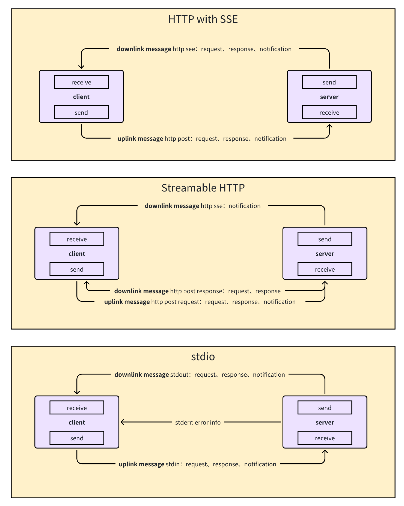

# MCP Go SDK Design Document

MCP Go SDK is a powerful and easy-to-use Go client library designed for interacting with the Management Control Panel API. This SDK provides complete API coverage, including core functionalities such as resource management, configuration, monitoring, and automation operations.

# Design Philosophy

- MCP Protocol Messages
  
  | Capability Provider | Capability      | Protocol Messages (Client Send)                                                                        | Protocol Messages (Server Send)                               |
  | ------------------ | --------------- | ----------------------------------------------------------------------------------------------------- | ----------------------------------------------------------- |
  | Client&Server      | Initialization  | • Initialize  • Initialized notifications                                                            | (None)                                                       |
  | Client&Server      | Ping            | • Ping                                                                                                 | • Ping                                                       |
  | Client&Server      | Cancellation    | • Cancelled Notifications                                                                              | • Cancelled Notifications                                    |
  | Client&Server      | Progress        | • Progress Notifications                                                                               | • Progress Notifications                                     |
  | Client             | roots           | • Root List Changes                                                                                    | • Listing Roots                                              |
  | Client             | sampling        | (None)                                                                                                 | • Creating Messages                                          |
  | Server             | prompts         | • Listing Prompts  • Getting a Prompt                                                               | • List Changed Notification                                  |
  | Server             | resources       | • Listing Resources  • Reading Resources  • Resource Templates  • Subscriptions: Request  • UnSubscriptions: Request | • List Changed Notification  • Subscriptions: Update Notification |
  | Server             | tools           | • Listing Tools  • Calling Tools                                                                    | • List Changed Notification                                  |
  | Server             | Completion      | • Requesting Completions                                                                               | (None)                                                       |
  | Server             | logging         | • Setting Log Level                                                                                    | • Log Message Notifications                                  |

- Interaction Details
  
    - Both client and server need to have send and receive capabilities
    - Messages can be abstracted into three types: request, response, and notification
    - The architecture can be abstracted into three layers: transport layer, protocol layer, and user layer (server, client)

- Design Principles
    - Protocol layer and transport layer are decoupled through the transport interface
    - Protocol layer contains all MCP protocol-related definitions, including data structures, request construction, and response parsing
    - Both server and client layers have send and receive capabilities. Send capabilities include sending messages (request, response, notification) and matching requests with responses. Receive capabilities include routing messages (request, response, notification) and handling them asynchronously/synchronously
    - Server and client layers implement the combination of requests and responses, presenting as synchronous request, processing, and response from the user's perspective

# Architecture Design

# Project Structure

    - transports
      - sse_client.go
      - sse_server.go
      - stdio_client.go
      - sdtio_server.go
      - transport.go // transport interface definition
    - pkg
      - errors.go // error definitions
      - log.go // log interface definition
    - protocol // contains all MCP protocol-related definitions, including data structures, request construction, and response parsing
      - initialize.go
      - ping.go
      - cancellation.go
      - progress.go
      - roots.go
      - sampling.go
      - prompts.go
      - resources.go
      - tools.go
      - completion.go
      - logging.go
      - pagination.go
      - jsonrpc.go
    - server
      - server.go
      - call.go // send messages (request, notification) to client
      - handle.go // handle messages (request, notification) from client, return response or not
      - send.go // send messages (request, response, notification) to client
      - receive.go // receive messages (request, response, notification) from client
    - client
      - client.go
      - call.go // send messages (request, notification) to server
      - handle.go // handle messages (request, notification) from server, return response or not
      - send.go // send messages (request, response, notification) to server
      - receive.go // receive messages (request, response, notification) from server 